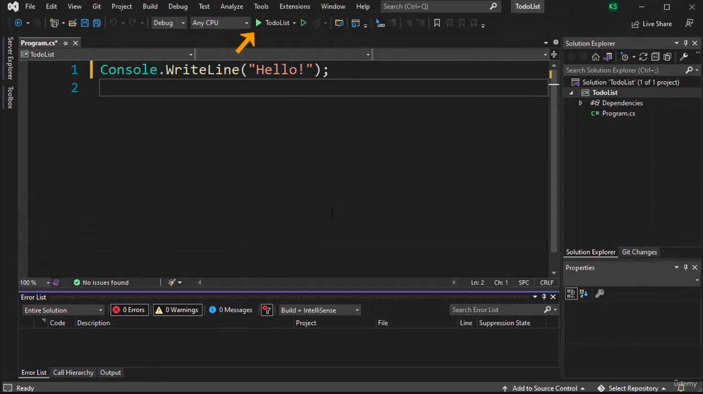
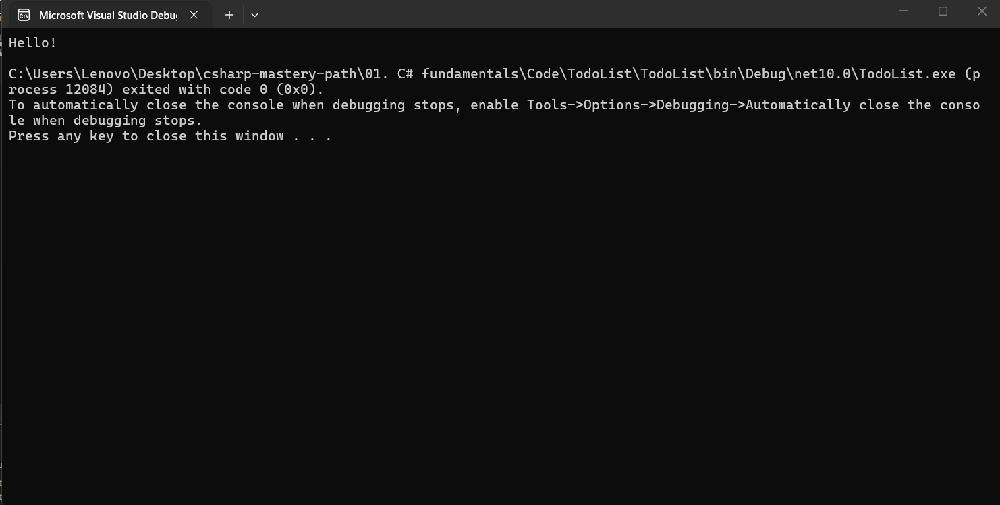
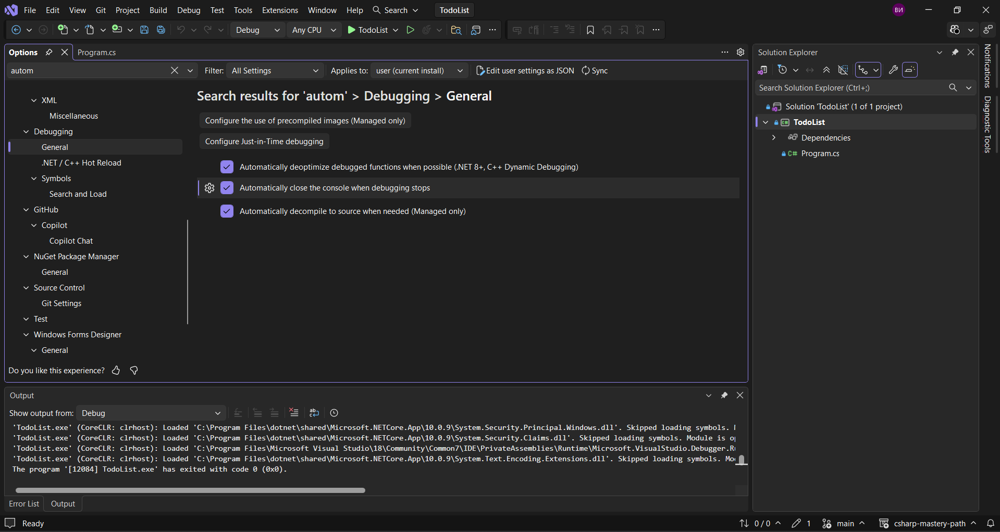
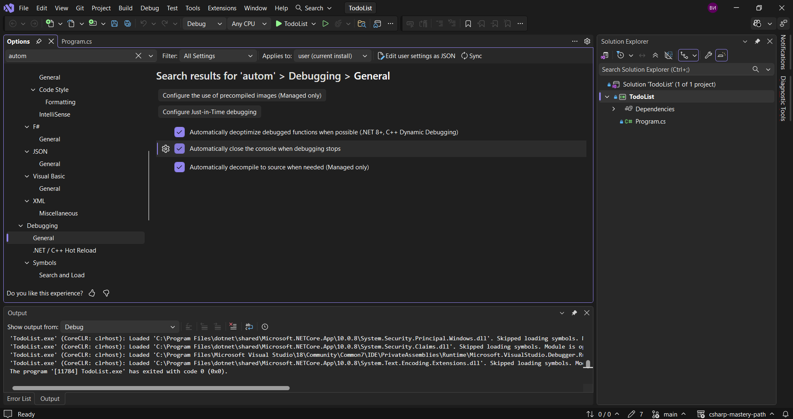

Нека да разберем какво ни е необходимо, за да си създадем един много прост калкулатор, който може само да добавя.
Първото нещо, което ни трябва, е да получаваме входни данни от потребител. Ние ще разгледаме това в тази лекция.
Второто нещо, което трябва да разберем, е как се съхраняват данни, как се съхранява стойност.
И накрая трябва да видим аритметичните операции, като например събиране в този случай.
Има и едно малко допълнително нещо, което трябва да разгледаме и това е как да преобразуваме от един тип данни в друг. Затова трябва да разберем кои типове данни са подходящи.
Нека да разберем как да получим входни данни от потребителя.
За да получим входни данни, ние отново ще използваме класа `Console`.
Ако го посочим с мишката, ще видим следното.



Той представлява стандартните потоци за вход и изход, както и за грешка. Този клас не може да бъде наследен.
Много думи, които на този етап не разбираме, но ще ги разгледаме по-късно. Важното обаче е, че това ни помага не само за изхода, но и за входа, така че можем да получим входни данни  с помощта на метода `ReadLine()`.

> [!code] Получаване на входни данни
> ```csharp
> Console.ReadLine();
> ```

Какво представлява този метод `ReadLine()`?
Както споменахме, това е метод.

> [!important]
> Методът е колекция от код или редове код, които ще се изпълнят, когато методът се извика.

По-късно ще видим как работят методите. По този начин ще имаме пълен контрол върху приложенията си.
Засега обаче ние ще използваме съществуващ, който се нарича `ReadLine()`.
Класовете могат да съдържат множество методи. Те могат да съдържат и други неща, но засега ще се концентрираме върху методите.
Как да съхраняваме въведените от потребителя данни? Затова имаме нужда от променлива.



Виждаме, че тук се изписано `string? Console.ReadLine()`.
Стрингът тук ни показва, че се връща нещо. Т.е. този `Console.ReadLine()` след като го изпълним, ни дава възможност да въведем нещо като потребител. И каквото и да въведем, то ще бъде съхранено, както ще направим в този случай, или нищо няма да се случи с него, ако не го направим.
За да го съхраним, ние използваме променлива.

> [!code] Съхраняване на входни данни
> ```csharp
> string userInput = Console.ReadLine();
> ```

И така, какво се случва тук?
Ние създадохме променлива с име `userInput` от тип данни стринг. Типът данни стринг е тип данни, който съдържа `текст`. 
Сега този `ReadLine()` ако го посочим с мишката ще видим, че връща стринг.



В него се казва основно следното. какво и да се съхранява в този `ReadLine()`, ще бъде съхранено в променливата `userInput`.
Сега основно това, което ни позволява да направим сега, е да речем, да отпечатаме на конзолата това, което потребителят е въвел.

> [!code] Отпечатване на входните данни в конзолата
> ```csharp
> Console.WriteLine("You entered " + userInput);
> ```

И така, ние използваме `Console.WriteLine()`, а след това вътре в скобите в кавички сме написали `You entered`, последвано от празно пространство и знака +, който служи за обединяване на два низа и идеята за образуване на един по-голям низ.
За да запазим нашата конзола будна и да не се затваря след този ред, ние ще добавим следното.

> [!code] Предотвратяване на автоматичното затваряне на конзолата
> ```csharp
> Console.ReadKey();
> ```

Това ще изчака да натиснем произволен клавиш, преди да затвори конзолата.
Вместо в началото да казваме `Hello, World!`, нека да го променим на следното.
Нека сега да стартираме това и да въведем някакъв текст.



И виждаме, че изписва `You entered Привет`.
Ние бяхме помолени от системата да въведем нещо. След което имаме `ReadLine()` метода, който очаква да въведем входни данни и каквото и да въведем, то ще бъде съхранено в променливата `userInput` i след това го отпечатваме в конзолата с помощта на нещо, наречено `конкатенация`.
Това е, което направихме в тази лекция.
Сега знаем как да използваме потребителския вход и научихме за един тип данни, наречен стринг.

