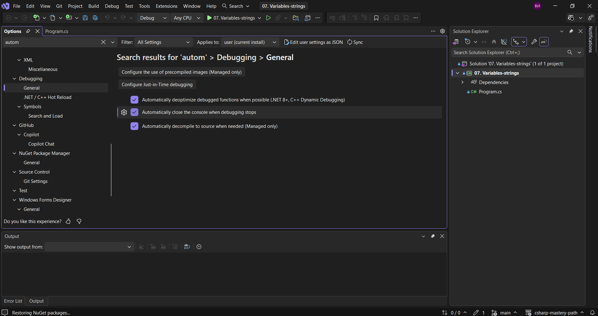

В тази лекция ще видим как набързо можем да се отървем от допълнителния текст, който се появява в конзолата и да се уверим ,че имаме пълен контрол над нашата конзола, защото това се генерира за нас.
Можем да видим, че можем да деактивираме това от `Tools -> Options -> Debugging > Automatically close the console when debugging stop.`.
Нека да направим точно това.



Нека да пуснем програмата отново.
Виждаме, че когато я изпълним, конзолата се отваря и затваря много бързо. 
Ние обаче искаме да сме сигурни, че това няма да се случи отново. Затова накрая въвеждаме следния ред.

> [!code] Предотвратяване на автоматичното затваряне на конзолата
> ```csharp
> Console.ReadKey();
> ```

Това ще изчака натискането на клавиш, преди да затвори конзолата.