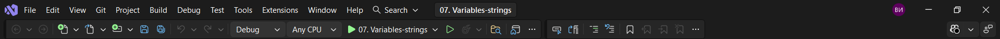
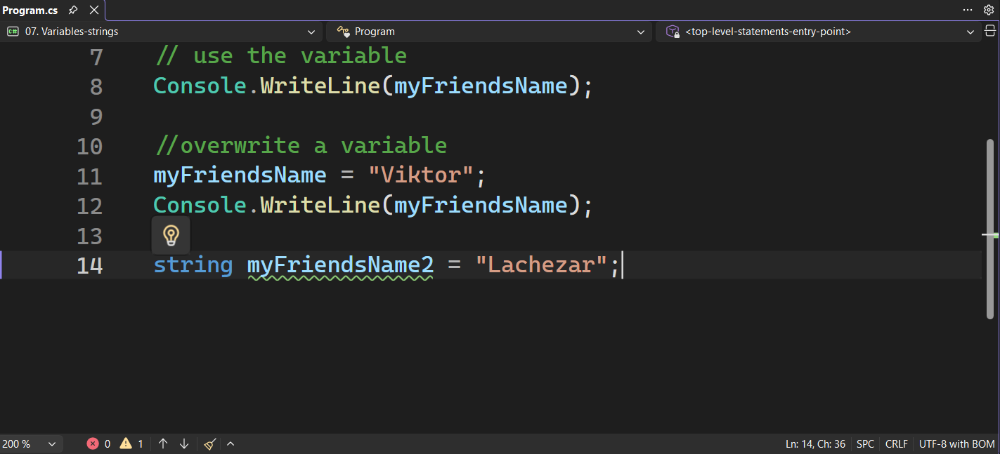
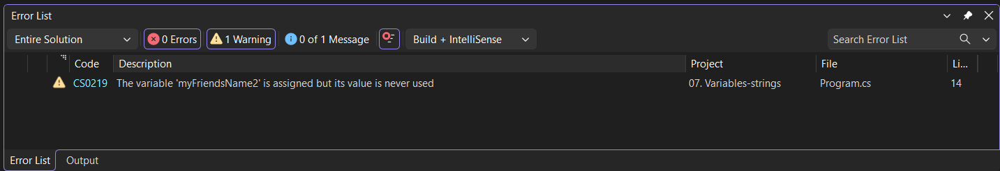
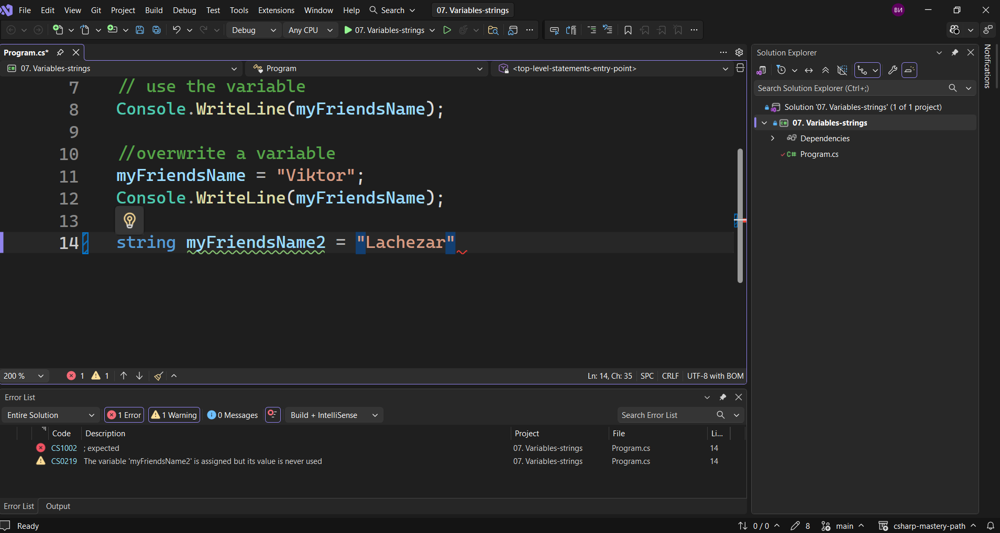
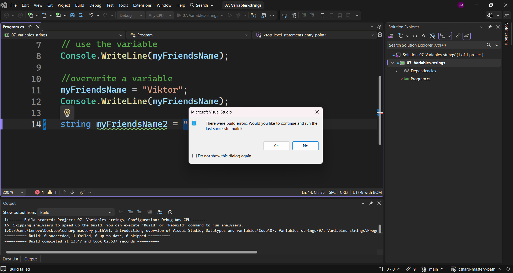
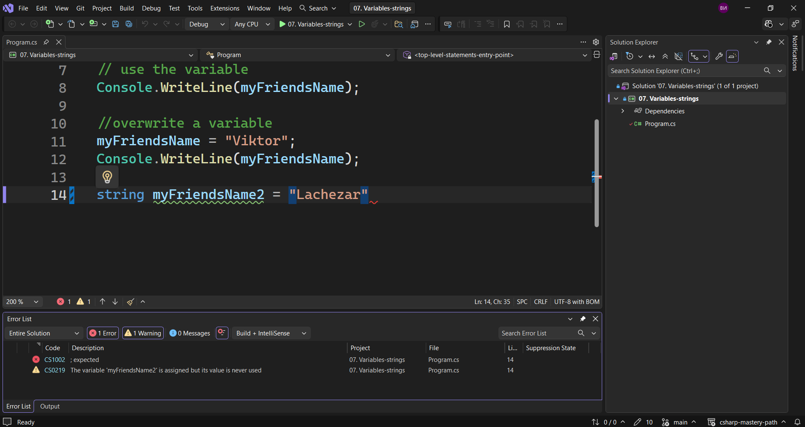
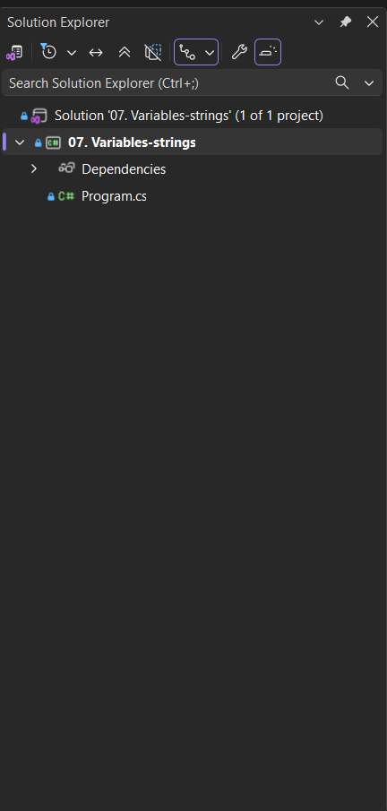
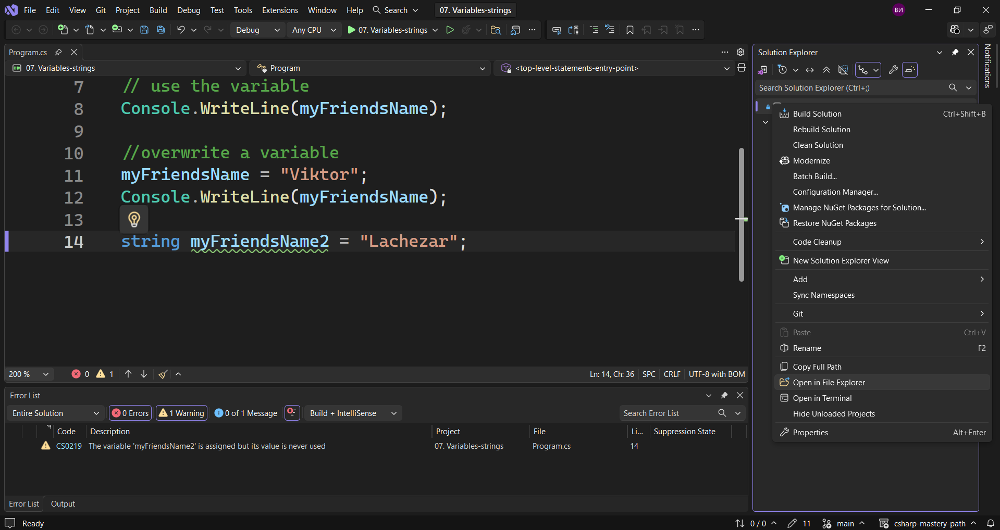
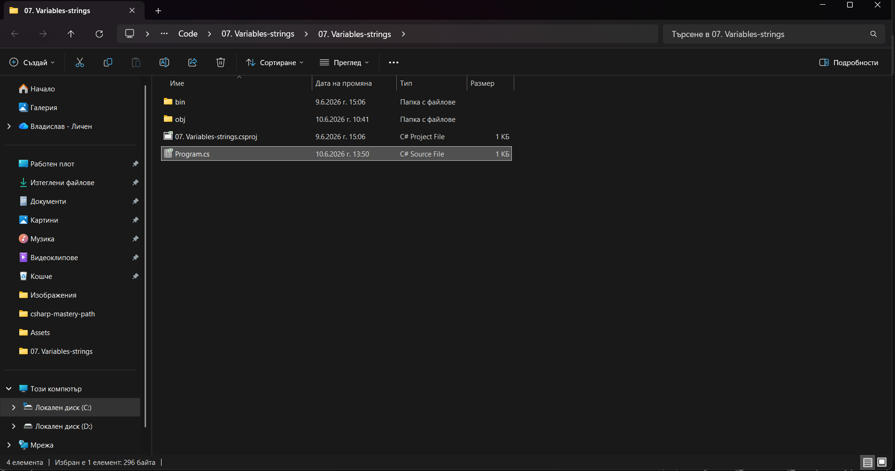

В тази лекция ще направим бърз преглед над това, което виждаме, когато отваряме `Visual Studio`, т.е. неговия интерфейс. Т.е. всички неща, които виждаме на екрана.



Тук ние имаме всички опции на разположение за нас, всички неща, които можем да правим с `Visual Studio`.
Най-важното или най-релевантното е мястото, където виждаме този `Program.cs`, където се намира целия ни код.



По-късно ни ще създадем още такива файлове, които ще съдържат код, но засега го правим просто.
И така, това е мястото, където ще се намира нашия код.
В долната част можем да видим, че получаваме изхода.



Тук можем да прочетем какъв изход получаваме от дебъгера. Това по-късно ни помага да открием грешките в кода.
Ако например нямаме точка и запетая тук

> [!code] Деклариране и присвояване стойност на променлива на един ред
> ```csharp
> string myFriendsName2 = "Lachezar";
> ```



и опитаме да стартираме това, ще получим грешка.



`Visual Studio` ни казва, че не може да стартира това. Същевременно в долната част получаваме съобщение с грешката, която ни казва, че се очаква точно точка и запетая.



Дори ни показва и реда, на който се очаква да добавим точка и запетая.
И така, в долната част ние виждаме списъка с грешки или изхода. Ние можем да изберем прозореца, който ни интересува. Можем да добавим и други прозорци, ако желаем, но засега няма да го правим.
Списъкът с грешки обикновено ни се показва автоматично.
От дясната страна ние виждаме т.нар. `Solution Explorer`, в който са всички файлове, които имаме в проекта.



Можем да видим, че тук се намира `Program.cs`. 
Нека да го изберем с десния бутон на мишката и след това `Open in File Explorer`.



Ще видим, че тук имаме всички тези файлове.



Вътре в нашата `07. Variables-Strings` ние имаме нашия `.slnx`  файл, което просто отваря нашия проект.
Ако отворим тази папка, можем да видим, че там се намира нашия `Program.cs`, можем да го отворим и той също ще отвори нашия проект.
Имаме и две папки - `obj` и `bin`, като `bin` папката съдържа дебъгването.
Това е само структурата на проекта. И когато създадем нов файл, той ще се намира тук.
Сега да разгледаме най-важните бутони, които имаме в горната част.
