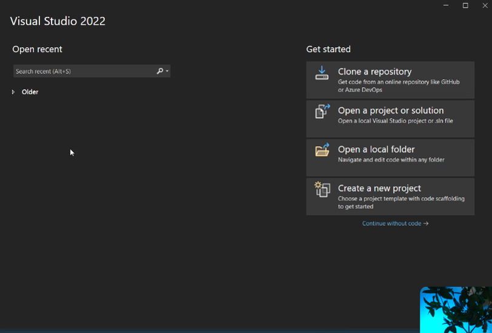
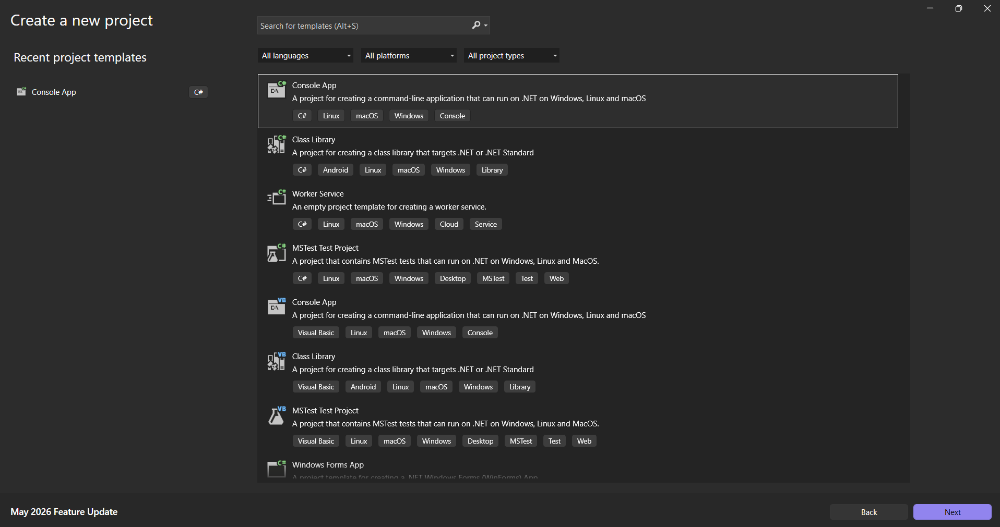
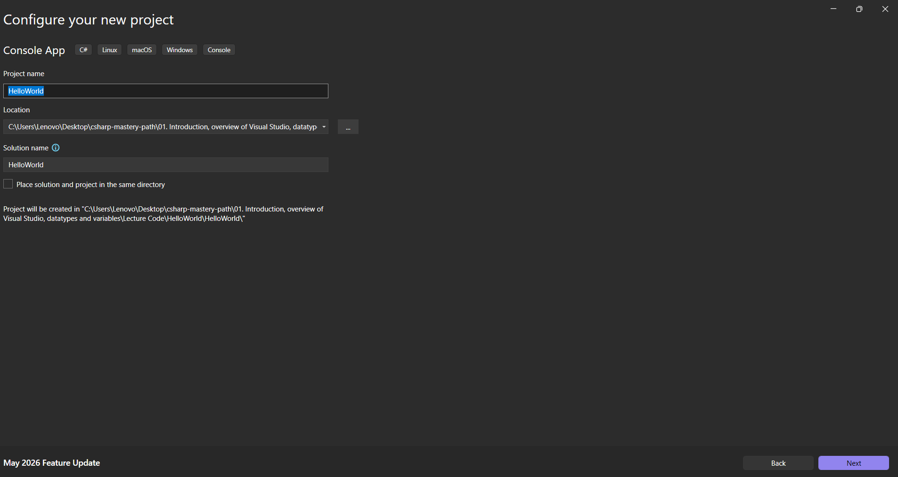
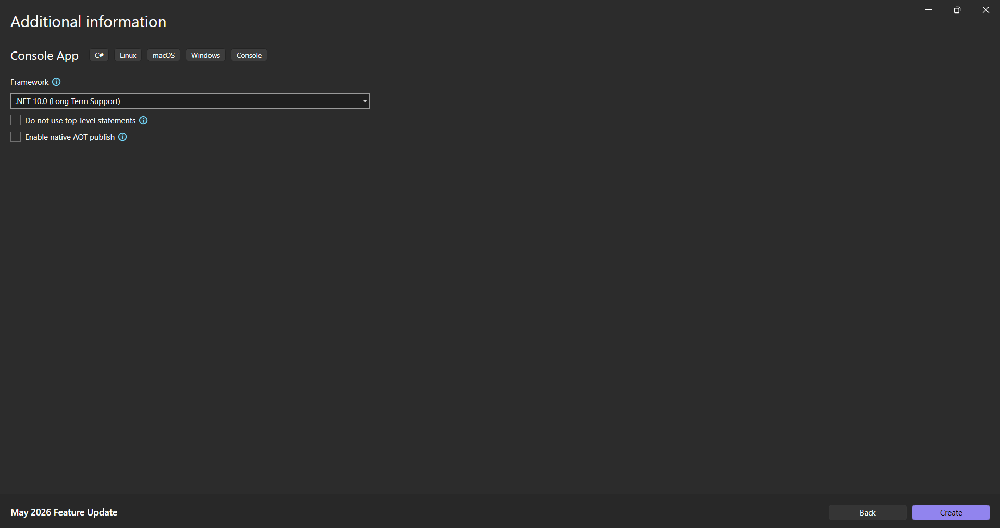
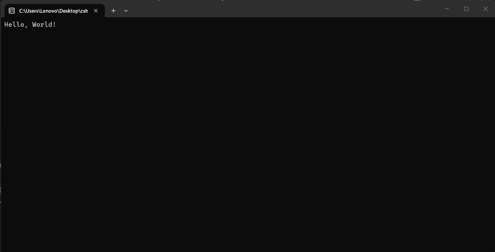

В тази лекция ще създадем първия си проект. Затова нека да видим какво можем да видим тук.





Това е маската, която ще видим, когато за пръв път отваряме `Visual Studio` и наскоро не сме имали отворен проект. Ние можем да продължим и да създадем нов проект.
След това ще трябва да изберем шаблоните, които трябва да се използват. Ние ще използваме `Console Application with C#`.




Можем да дадем име на това приложение и ще го наречем `HelloWorld`.



След това можем да изберем рамката, която искаме да се използва.



И след това, за да го държим просто, няма да поставяме отметка в нито едно от квадратчетата. По-нататък ще видим какво представляват тези квадратчета.
И ето ни - ние вече си имаме нашия малък софтуер. Виждаме, че по подразбиране той има два реда код.
Нека да се концентрираме върху тази част, където се намира нашия код и можем да видим, че директно се казва

> [!code] Първи код
> ```csharp
> Console.WriteLine("Hello, World!");
> ```

Това е кодът по подразбиране, който пишем, когато създаваме нов проект, а `Hello World` е това, което опитваме винаги да покажем, а тук ще го покажем на конзолата?
И така, какво е конзолата?
Нека да стартираме нашия код, като натиснем `[F5]`, за да видим какво ще ни покаже конзолата. След няколко секунди се стартира тази малка конзола.



И така, това е нашата програма. Това е първата ни програма, която разработихме и ни казва `Hello, World!`. 
Можем да натиснем произволен клавиш, за да затворим този прозорец.
Можем да заменим текста в скобите, за да се покаже нещо друго. Нека да го направим.

> [!code] Промяна на първоначалния код
> ```csharp
> Console.WriteLine("Hello, C#!");
> ```

Това е всичко. По този начин ние създадохме и стартирахме първата си програма.
