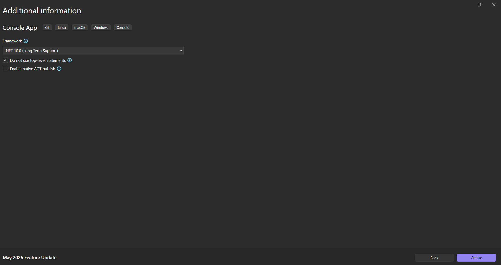

В тази лекция ще разгледаме първия ред код, който имаме, но досега не сме го обсъждали. Виждаме, че се казва

> [!code] Едноредов коментар
> ```csharp
> // See https://aka.ms/new-console-template for more information
> ```

В общи линии това е коментар. Какъвто и код да имаме след двете наклонени чертички, той няма да се разглежда като изпълним код, а като коментар за нас като програмист. Това няма да се отрази на нашия софтуер, но ще ни помогне по-добре да разберем какво прави кода, след като не сме го преглеждали от известно време или работим с други програмисти.
Това е нещо, което можем да използваме лесно. Можем да добавим още един коментар тук.

> [!code] Добавяне на нов коментар
> ```csharp
> // this is another comment
> ```

Това е много прост едноредов коментар, който можем да използваме по всяко време. Много е полезно, когато искаме да опишем какво прави следващия ред код.



Последният път ние не го избрахме, което доведе до един дизайн. Този път обаче ще го изберем и това ще доведе до следния дизайн.


