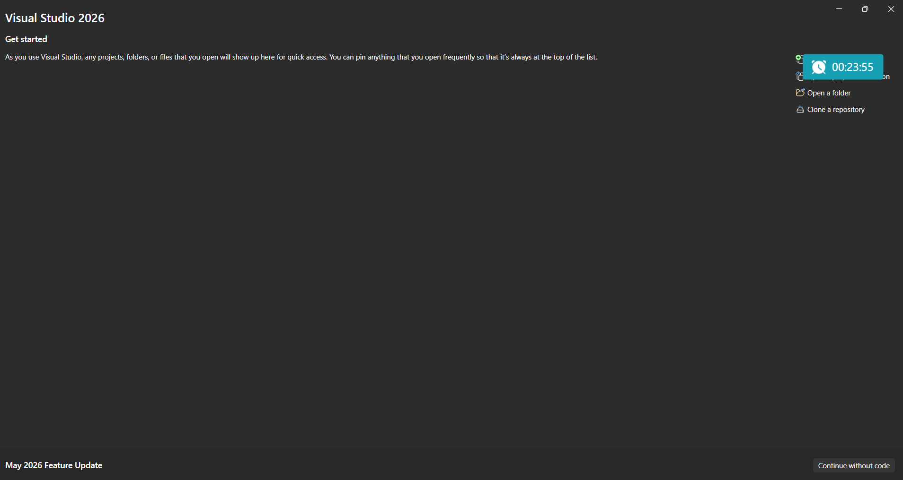
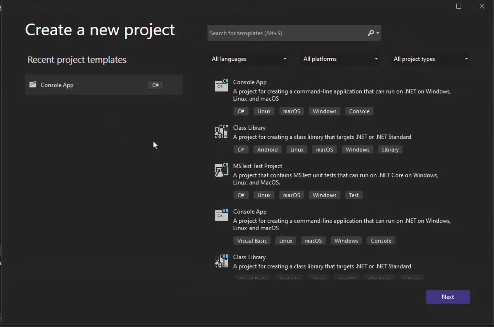
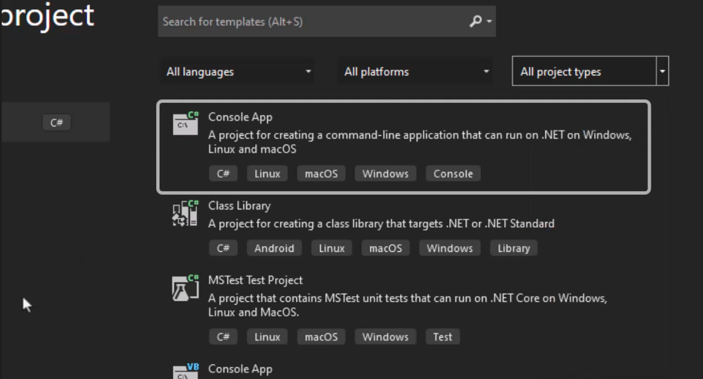
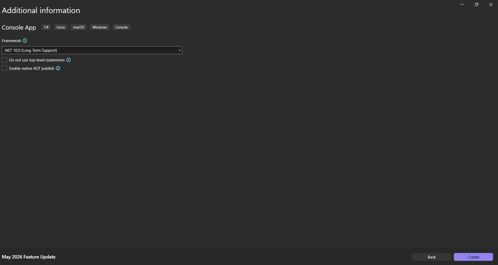
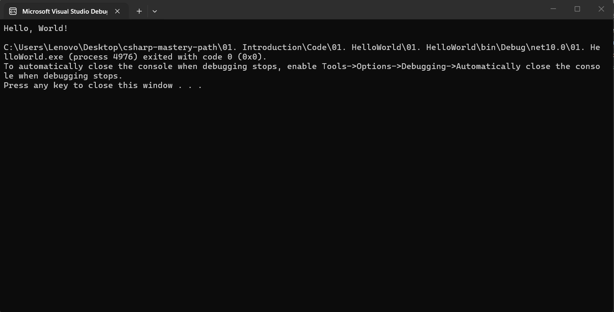
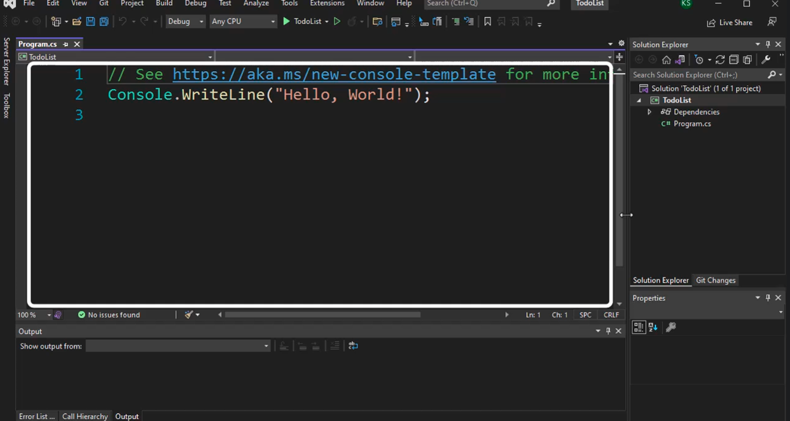
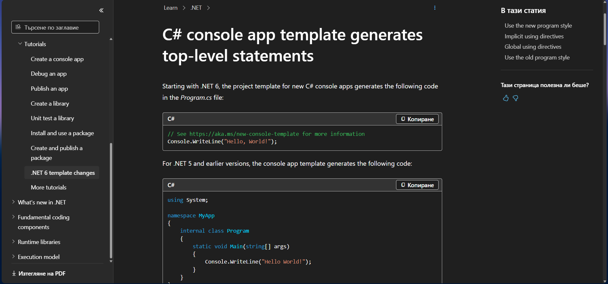
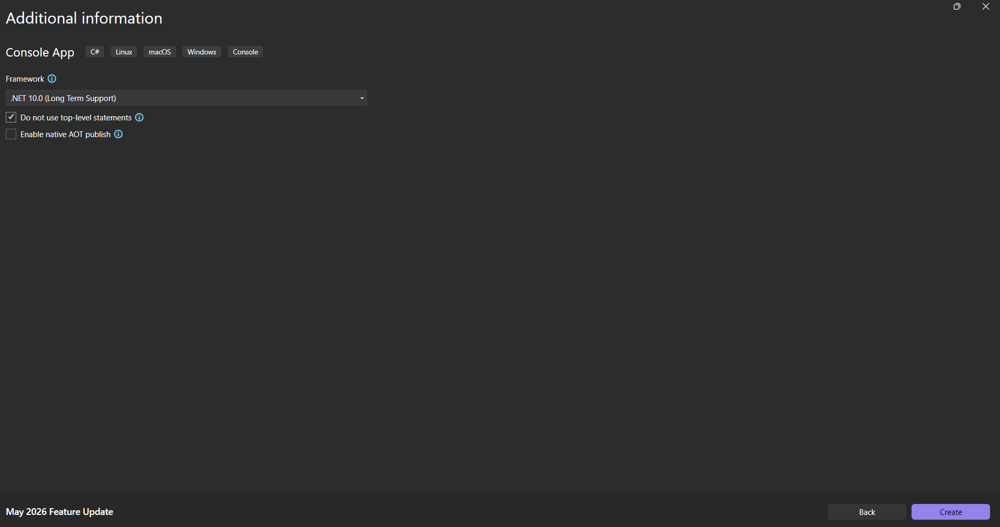
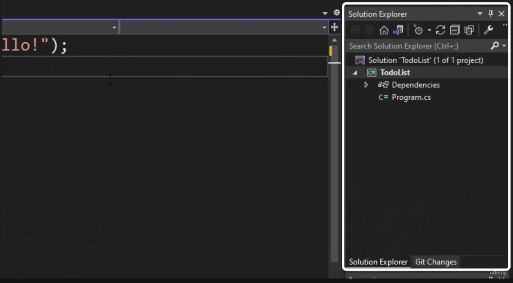
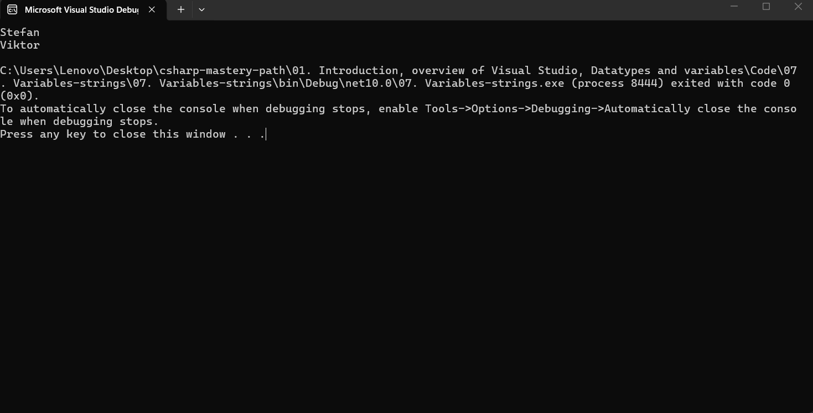

В тази лекция ще научим как се създават проекти на C#. 
Ще разберем и значението на съкращението `IDE`.  Освен това ще научим какво представляват коментарите и как да отпечатваме съобщения в конзолата. Накрая ще видим как да конфигурираме опциите във `Visual Studio`.
Нека да създадем първата си C# програма.
Отваряме `Visual Studio` и избираме създаване на нов проект.



В този прозорец има няколко шаблона за проекти, от които можем да избираме.



С `.NET` можем да създаваме различни приложения за различни платформи и потребители.
Засега избираме `Console Application`, като се уверяваме ,че сме избрали C#.



Нека да го наречем `TodoList`.



Тук можем да изберем рамката, която да използваме. Няма да променяме нищо тук.
И ето го нашия проект. Той е готов за работа още сега. Преди да го направим, нека да разгледаме наоколо.



В този прозорец виждаме изходния код на нашата програма.

> [!info]
> Изходният код е просто текст.

Ние бихме могли да създаваме подобни проекти и с `Notepad`, но това не би било много удобно.

> [!important]
> Visual Studio е мощна среда за разработка (IDE) - среда, която позволява на програмистите да пишат изходен код.

Нека да модифицираме тази програма.
На първо място, това е коментар.



Това е текст, който не се компилира или изпълнява, затова можем да го изтрием.
Сега следващия ред. Както вече сме се досетили, това е код, който отпечатва ред текст на конзолата.

> [!code] Първи код
> 
> ```csharp
> Console.WriteLine("Hello, World!");
> ```

Можем да променим съобщението, което ще се отпечата, на каквото пожелаем.

> [!code] Промяна на първоначално съобщение
> 
> ```csharp
> Console.WriteLine("Hello!");
> ```

В C# в края на всеки ред ние трябва да завършваме с точка и запетая.



Забравянето му е често срещана грешка при начинаещите.
нека да разгледаме други прозорци на Visual Studio.



Тук ние виждаме т.нар. `Solution Explorer` с нашия проект и всички файлове, които той съдържа.



В момента ние имаме един файл, наречен `Program.cs`.
Всички файлове, които имат C# код, трябва да завършат с разширение `.cs`.
В долната част най-0интересен за нас е списъкът с грешки (`Error List`). В момента ние имаме 0 грешки и предупреждения, което е страхотно.



Нека сега да стартираме тази програма, като натиснем зелената стрелка горе.


На конзолата получаваме следното


Първата ни C# програма е готова и работи.
Тук имаме текста `Hello`, който се е отпечатал в конзолата.
Виждаме и едно допълнително съобщение, в което ни  се казва, че трябва да натиснем произволен клавиш, за да затворим конзолата.
Ние обаче не искаме това съобщение а се показва, тъй като това е допълнителна стъпка, генерирана за нас от  Visual Studio и не идва директно от нашия код.
Нека да го деактивираме, за да имаме пълен контрол върху кода.
За да го направим, отиваме в `Tools -> Options -> Debugging -> General -> Automatically close the console when debuggin stop`.


Сега можем да стартираме приложението отново.
Конзолата ни беше затворена веднага. Нека да разберем защо се случи това.
Нашата програма има само един ред код. След като той е изпълнен, няма какво друго да се прави и програмата се затваря.
Нека да добавим втори ред.

> [!code] Предотвратяване на автоматичното затваряне на конзолата
> 
> ```csharp
> Console.ReadKey();
> ```

Този ред ще накара конзолата да спре и да изчака потребителят да натисне произволен клавиш, след което ще се затвори.
Направихме първата си стъпка в програмирането.