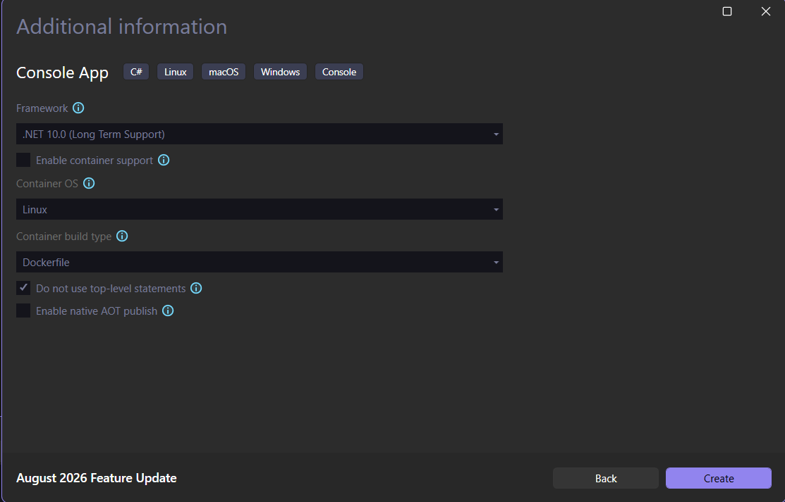

В тази лекция ще натиснем върху връзката, която видяхме в предходната лекция.
Той ни изпраща на този сайт в Майрософт, отнасящ се до генерирането на изявления от тип ниво.
Тук ни се казва, че C# приложенията генерират подобни изявления. Какво обаче се случва тук?
След пускането на .NET6, Майрософт е добавил следния коментар във Visual Studio, където ако създаваме конзолно приложение, имаме възможност да махнем отметката, селектирайки квадратче.
Нека да видим кое квадратче имаме предвид. За целта ще направим нов проект.



Последният път ние не маркирахме това квадратче, но този път ще го направим. Сега обаче ще получим този код.

> [!note] C# Пример: Топ-нови изявления
> ```csharp
> namespace TopLevelStatements
> {
> internal class Program
>    {
> 	static void Main(string[] args)
> 	 {
> 	     Console.WriteLine("Hello, World!");
> 	 }
>  }
 }
> ```

Тук се случват много повече неща. Изведнъж ние имаме доста повече код. Ние обаче знаем само един ред код, който е същият като този, който написахме в първата лекция. Около него сега има други неща.
Откъде обаче идва целия този код?
В миналото това бе необходимо, когато създаваме каквото и да е конзолно приложение на C#.
Виждаме, че не сме написали нито един ред код, всичко това се появи автоматично.
Тук се случват много неща и няма да навлизаме в подробности за тях точно сега.


