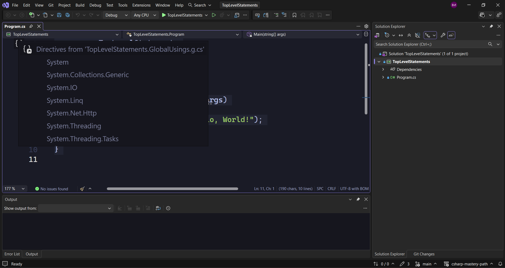

Ако сме били наблюдателни последния път, трябва да сме видели, че следния код

> [!note] C# Пример: системни директиви
> ```csharp
> using System;
> ```

го нямаше никъде, въпреки че кодът ни е еднакъв.
Къде се използва това?
Въпросът е, че това е скрито ето тук.



Тук ще намерим директиви от конзолното приложение за глобално използване. Това приложение изпозлва всички
