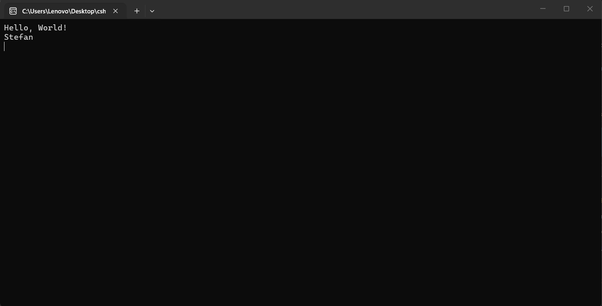
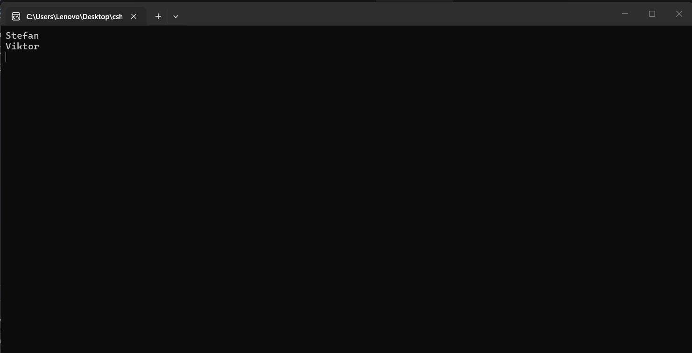

В тази лекция ще разгледаме как можем да декларираме променлива, как можем да зададем стойност на тази променлива, как можем да я променим и как да получим достъп до нея.
Започваме с това как да декларираме променлива.
Създаваме променлива, която ще се нарича така.

> [!note] C# Пример: Деклариране на променлива
> ```csharp
> // declare a variable
string myFriendsName;
> ```

Това е променлива, която е тип **string**, което означава, че тя може да съдържа само и единствено данни от тип **стринг**.
След това ние можем да зададем стойност на тази променлива.

> [!note] C# Пример: Задаване стойност на променлива
> ```csharp
> myFriendsName = "Stefan";
> ```

Виждаме, че на нов ред използваме името на променливата, последвано от знака = и стойността, оградена в кавички. Това е **стринг**.
Как можем да разберем, че това е стринг? от това, че сме го обградили в двойни кавички. Ние винаги започваме стринг с кавички и го завършваме с кавички. Затова трябва да обградим стринга с кавички.
По този начин ние **присвояваме стойност на променлива**.
Всеки път ние завършваме с точка и запетая.
Сега ще използваме променливата и ще го направим в конзолата.

> [!note] C# Пример: Достъп до променлива
> ```csharp
> //use the variable
Console.WriteLine(myFriendsName);
> ```

По този начин получаваме **достъп до променливата**.
Това ще представи всичко, което се намира в променливата, която съдържа тест и сега този текст ще се покаже в конзолата.



Как обаче сега да презапишем това име?
Променливите в C# могат да бъдат презаписвани. Затова ние просто можем да кажем

> [!note] C# Пример: Презаписване на променлива
> ```csharp
> //overwrite a variable
myFriendsName = "Viktor";
> ```



По този начин ние **презаписваме стойност на променлива**.
Променливите са много полезни. Позволяват ни да ги използваме повторно навсякъде в нашия код и да съхраняваме данни.
Ние можем да декларираме и зададем стойност на променлива и само на един ред. Няма нужда да го правим на два реда. Можем да го направим и на един ред.

> [!note] C# Пример: Деклариране и използване на променлива
> ```csharp
> string myFriendsName2 = "Kristian";
> ```

Това е друго алтернатива за работа.
Виждаме, че използваме конвенция за именуване, където името на променливата започва с малка буква, а всяка следваща дума е с главна буква.