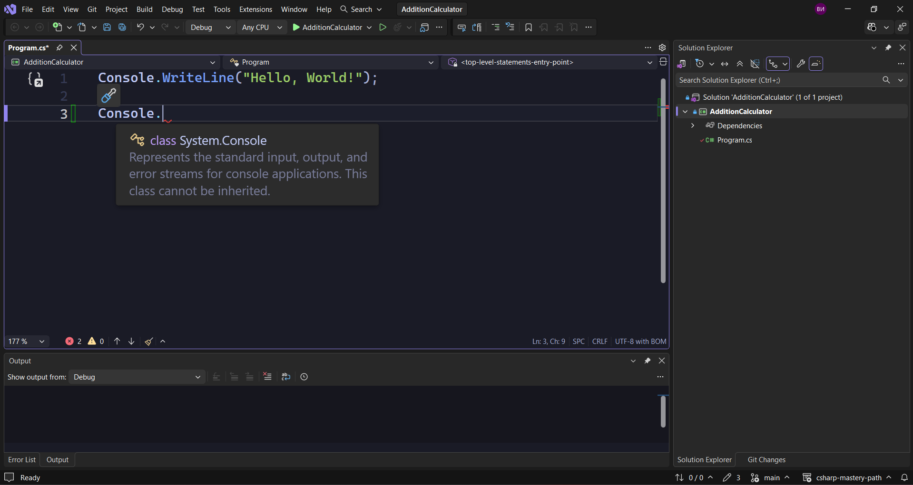
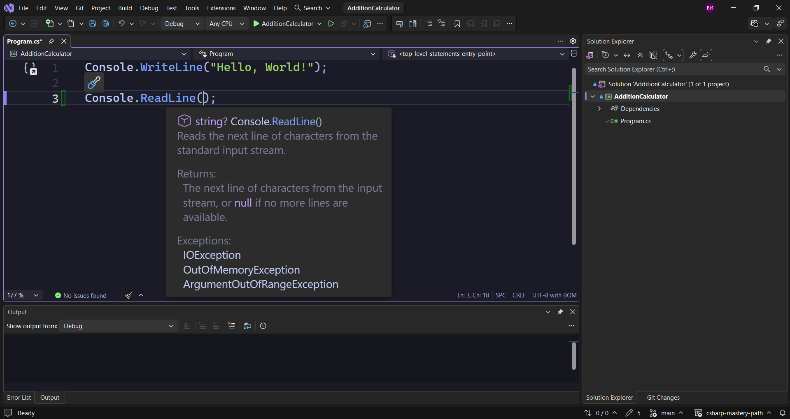
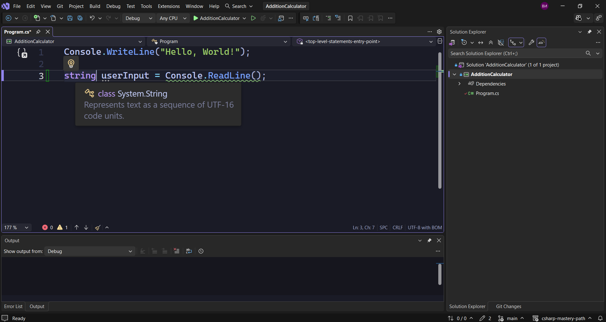

Нека да видим какво ни е необходимо, за да си създадем калкулатор, който на този етап ще може само да добавя.
Първото нещо, от което се нуждаем, са входни данни от потребителя. Това ще разгледаме в тази лекция.
Второто нещо, което трябва да разберем, е как да съхраняваме данни, как се съхранява стойност.
И третото нещо ще бъдат аритметичните операции, в случая събиране.
Има и едно допълнително нещо, което трябва да разгледаме и това е преобразуването от един тип в друг. Затова трябва да знаем кои типове данни са подходящи.
Нека да разберем как да получим входни данни от потребителя.
Създаваме си нов проект, който ще се казва **AdditionCalculator**.
За целта ние отново ще използваме класа **Console**.



Можем да видим, че като посочим този клас, той представлява стандартните потоци за вход, изход и грешка. Този клас не може да бъде наследен.
Важното обаче е, че това не ни помага само за изхода, но и за входа, така че можем да го използваме, за да получим потребителски вход, като използваме метода **ReadLine()**.

> [!note] C# Пример: Получаване на потребителски вход
> ```csharp
> Console.ReadLine();
> ```

Какво представлява този метод **ReadLine()**?
Както казахме, това е метод, а методът е колекция от код или редове код, които се изпълняват, когато методът се извика. По-късно ние ще видим как да създаваме наши собствени методи. По този начин ще имаме пълен контрол върху приложенията си.
Засега обаче ние ще използваме съществуващ, наречен **ReadLine().**
Класовете могат да съдържат много методи. Те могат да съдържат и други неща, но засега ще се фокусираме върху методите.
Как обаче да съхраним получените входни данни от потребителя? За целта ние ще имаме нужда от променливи.



Виждаме, че тук пише **string? Console.Readline()**. Стрингът тук показва, че се връща нещо. Този метод, след като се изпълни, ни дава възможност да въведем нещо като потребител. Каквото и да въведем, то ще се съхрани, както ще направим в този случай, или нищо няма да се случи с него, ако не го ползваме.
Затова, за да го съхраним, ние ще използваме променлива.

> [!note] C# Пример: Съхраняване на потребителски вход в променлива
> ```csharp
> string userInput = Console.ReadLine();
> ```

И така, какво се случва тук?
Създадохме променливата **userInput**, която е от тип данни **стринг**. Типът данни стринг е този тип, който ние използваме, за да съхраним текст.



Ние разбрахме, че методът **ReadLine()** може да върне текст. Общо взето се казва, че каквото се върне от този метод, ще се съхрани в променливата **userInput**, която е от тип **стринг**.
Това, което сега можем да направим, е да отпечатаме това, което потребителят въведе като входни данни.

> [!note] C# Пример: Отпечатване на входни данни
> ```csharp
> Console.WriteLine("You entered " + userInput);
> ```

Използваме **Console.WriteLine()** и след това вътре в скобите имаме **You entered**, последвано от празно място и знака + плюс това, което ще получим като входни данни.
Вместо да казваме **Hello World** горе в нашето приложение, нека да го променим на **Enter something**.

> [!note] C# Пример: Отпечатване на входни данни
> ```csharp
> Console.WriteLine("You entered " + userInput);
> ```