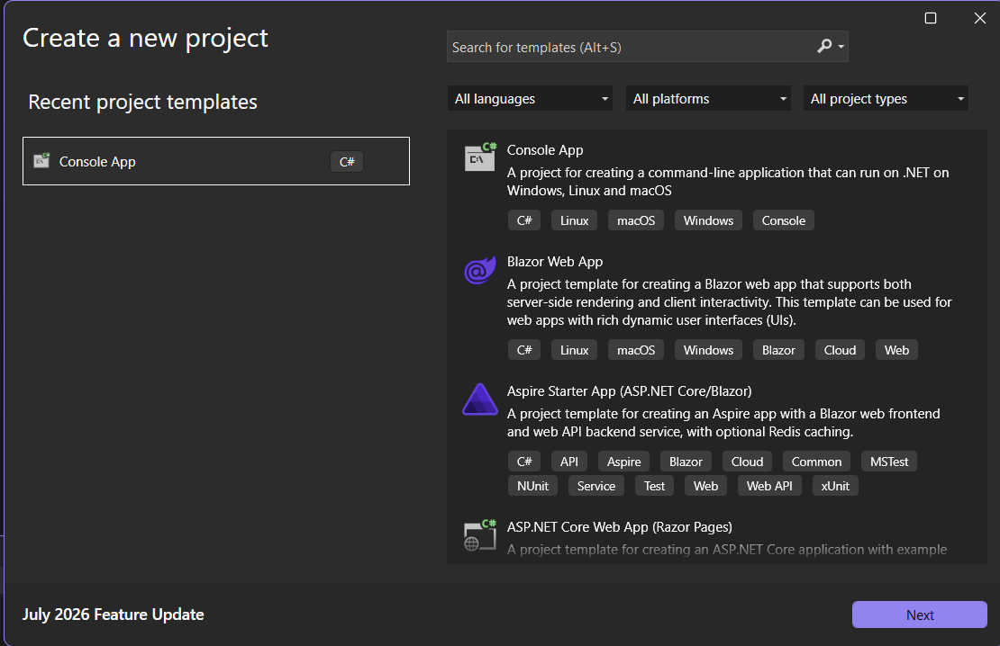
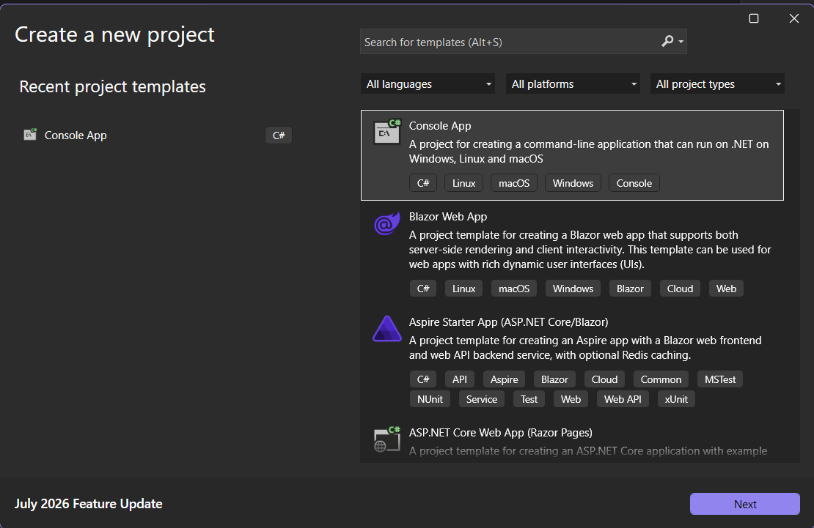
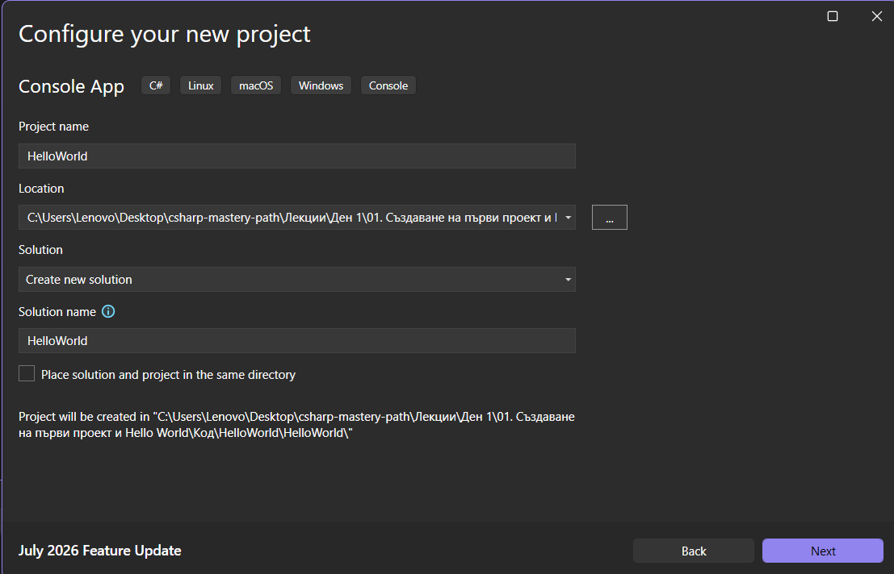
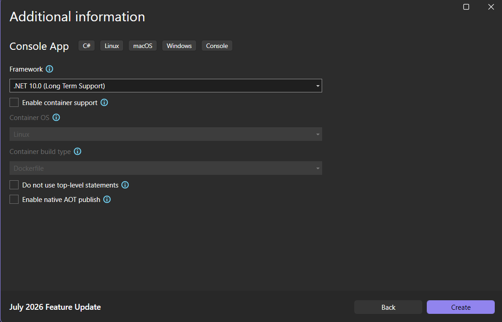
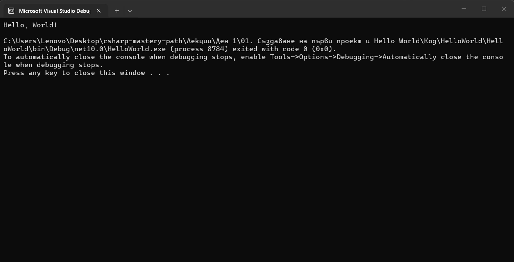

В тази лекция ние ще създадем първия си проект. Затова нека да видим какво можем да видим тук.



Това е маската, която изскача, когато за пръв път отворим `Visual Studio` и нямаме проект в него. Затова можем да създадем нов проект.
Ще видим, че след това трябва да изберем шаблоните, които искаме да използваме. Ние ще използваме `Console Application with C#`.



Можем да дадем име на приложението и ще го наречем `HelloWorld`.



Тук можем да изберем рамката, която искаме да използваме. На този етап имаме само 10, така че няма да я променяме.



За да не се затрудняваме, няма да поставяме отметка в квадратчетата на този етап. По-нататък ще видим какво представляват те.
И ето, имаме си нашия първи софтуер. По подразбиране той има 2 реда код.
ще се концентрираме върху частта, където се намира нашия код и можем да видим следното.

> [!code] Първи C# код
> ```csharp
> Console.WriteLine("Hello, World!");
>  ```

Това е кодът по подразбиране, който пишем, когато изучаваме нов език за програмиране, винаги първо се опитваме да напишем `Hello World` и да го покажем на екрана, а тук ние ще го покажем на конзолата.
Какво представлява конзолата?
Ще стартираме нашия код, като натиснем зелената стрелка или като изберем `[F5]`.



След няколко секунди се появява тази малка конзола. Това е нашата програма, нашия първи софтуер, който разработихме и ни казва `Hello World`.
Можем да натиснем произволен клавиш, за да затворим този прозорец.
Можем да заменим текста в скобите, за да покажем нещо друго. Затова нека да напишем следното.

> [!code] Промяна на текста в скобите
> ```csharp
> Console.WriteLine("Hello, Engineer25!");
>  ```


По този начин ние създаваме първия си проект и стартираме първия си код.


