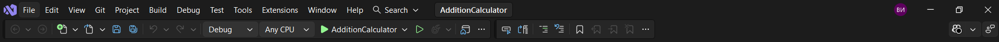
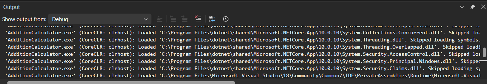
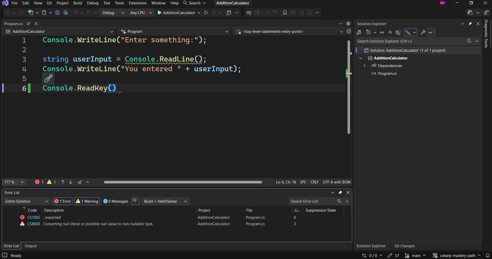
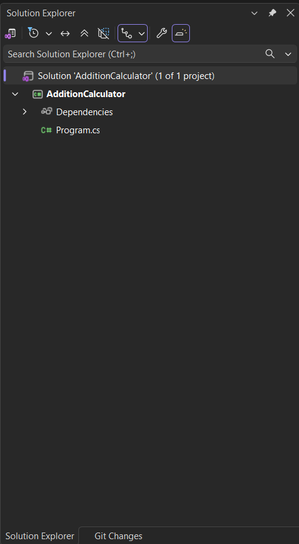
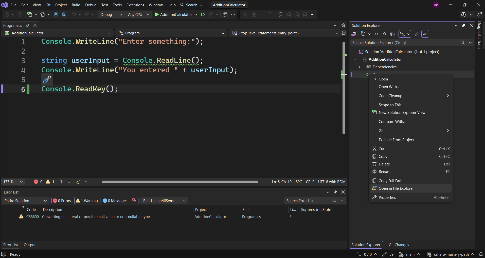
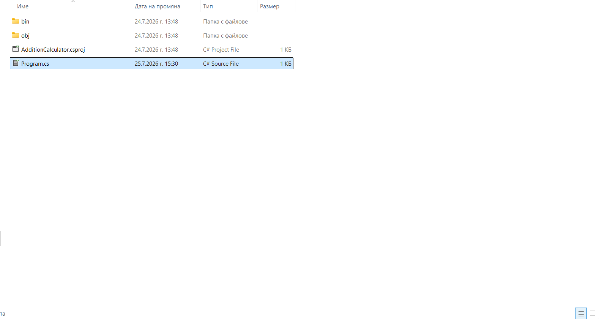
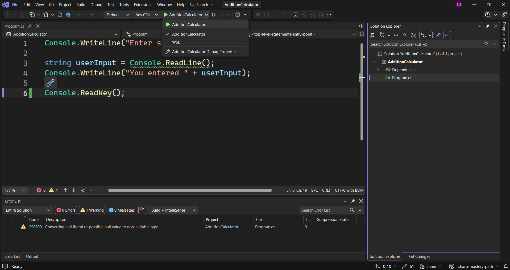

Нека да разгледаме най-важните части на Visual Studio от потребителския интерфейс, т.е. всички неща, които виждаме на екрана.

Очевидно е, че тук разполагаме с всякакви опции. По-важното обаче е тази част, където се намира `Program.cs`, който е файлът, където се намира нашия код в момента. По-късно ние ще създадем още такива файлове.
Видяхме, че това е мястото ,където отива нашия код.
В долната част виждаме, че получаваме изхода.

Тук четем какво получаваме от дебъгера. Това ни помага да открием грешките, които можем да имаме в кода.
Ако например тук нямаме точка и запетая, ще получим грешка.

Visual Studio вече ни казва, че не може да го стартира.
В същото време долу получаваме списък с грешки, който ни казва, че очаква точка и запетая.
Можем да имаме и повече прозорци, ако желаем, но на този етап това не е необходимо. Списъкът с грешки се показва автоматично за нас.
От дясната страна виждаме т.нар. `Solution Explorer`, в който се намират всички файлове, които имаме в проекта.

Ако погледнем този `Program.cs`  файл можем да видим, че е този, който сме отворили в момента. Нека сега да го изберем с десен бутон на мишката и след това `Open in File Explorer`.

Виждаме, че това има всички файлове.

Виждаме, че вътре в папката `AdditionCalculator` ние имаме т.нар. `.slnx` файл. Това основно отваря нашия проект.
Ако обаче отворя самата папка, ще видим, че там се намира `Program.cs` файла и той също ще отвори нашия проект.
И накрая ние имаме папки `obj` и `bin`, в която се съдържа нашето дебъгване.
Това е само структурата на проекта. И когато създадем нов файл или папка, той ще се намира тук.
неяка да разгледаме най-0важните бутони, които имаме в горната част.
Ние имаме този `AdditionCaluclator` бутон, който е името на проекта, което имаме. Можем да го стартираме или да отстраняваме грешки в свойствата.

До него имаме друг бутон, който е за възпроизвеждане, но не е запълнен. Той ни позволява да стартираме без отстраняване на грешки.
Какво в случая представлява дебъгването?
Дебъгването е процес, при които отстраняваме грешки в нашия код.
Какво е греша/бъг?
Бъгът е грешка в нашия код, но това не е краят или друг вид грешка. Това е действителна грешка в кода и понякога грешките могат да бъдат видими, като например тази с точката и запетаята от по-горе. Има обаче и грешки, които се появават по време на изпълнение на кода, т.е. след като програмата се изпълни.