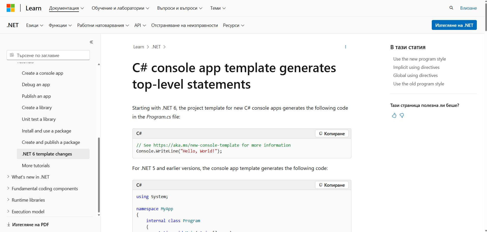
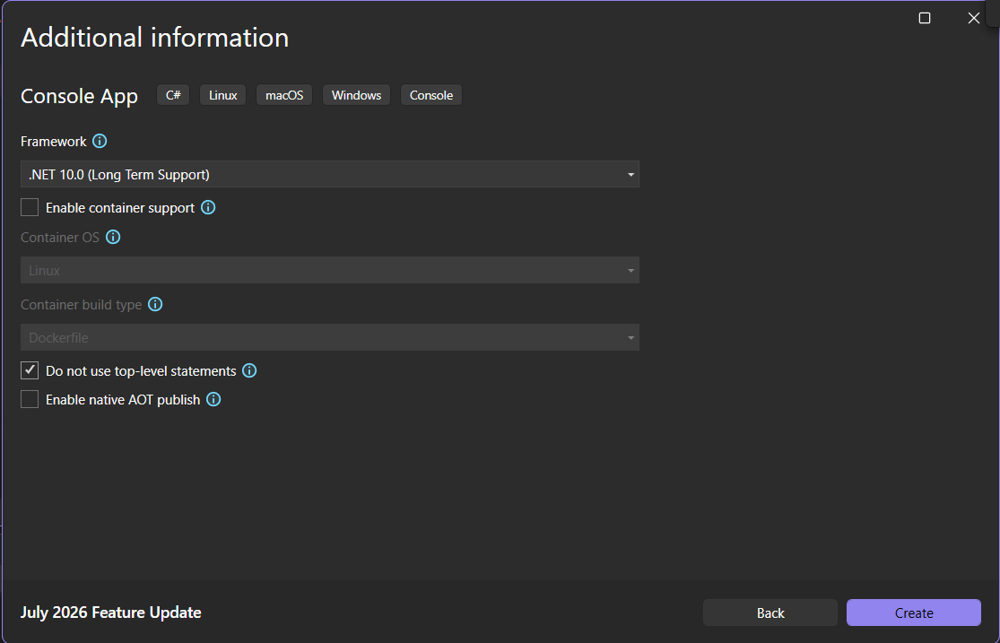

В тази лекция ще натиснем връзката от миналата лекция.
Това ни изпраща на този сайт, създаден от Microsoft, който е свързан с топ-ниво изявления.



Тук се казва, че C# генерира изявления от топ-ниво.
Какво се случва тук?
След пускането на `C# 6` преди няколко години, Microsoft е добавил горния коментар във `Visual Studio`, където ако създаваме конзолно приложение, имаме възможност да премахнем отметката от съответното квадратче. Нека да видим за кое квадратче става на въпрос.
Създаваме нов проект.



В последния ни проект ние не маркирахме това квадратче, но нека сега да го направим.
Сега кодът ни ще изглежда по много по-различен начин.

> [!code] Топ-ниво изявления
> ```csharp
> namespace ConsoleApp1
> {
> 	internal class Program
> 		{
> 		static void Main(string[] args)
> 		{
> 		Console.WriteLine("Hello, World!");
> 	}
> }
}
> ```

Тук се случват доста повече неща. Изведнъж виждаме, че имаме доста повече код, но ние знаем кода само на един ред. Това е същото, което ние използвахме в предишния ни проект. Около него сега има други неща. Откъде обаче идва целия този код?
В миналото това бе необходимо, когато стартирахме каквото и да е конзолно приложение.
Виждаме, че не сме написали нито един ред код, а това се появи автоматично за нас.
Тук се случват много неща и ние няма да навлизаме в подробности за тях сега.


