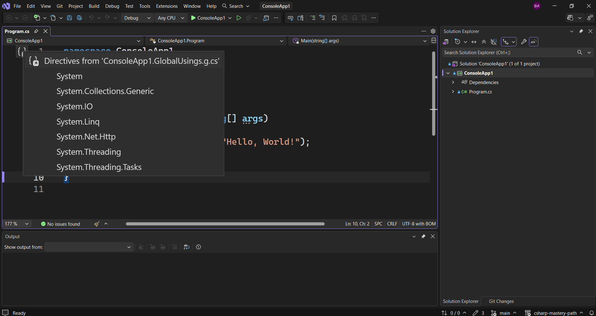

Ако сме били внимателни в предната лекция, вероятно сме забелязали, че следния код

> [!code] Системни директиви
> ```csharp
> using System;
>  ```

не се вижда никъде в кода, въпреки че той е като този в документацията. Къде се използва това?
Отговорът е, че това е скрито ето тук, в тези къдрави скоби.



Тук ще намерим глобални директиви от конзолното приложение, което използваме в момента. То използва всички тези директиви, които са просто библиотеки. Всяка от тези библиотеки съдържа куп редове код, които знаят как да се справят с нашата програма.
Ние можем да създаваме наши собствени директиви и след това да ги използваме, но това ще стане по-късно. Ние няма да използваме тези директиви още известно време.
