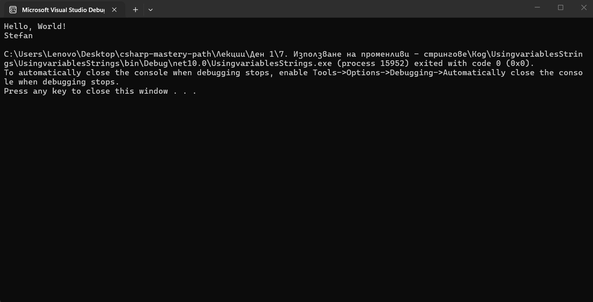
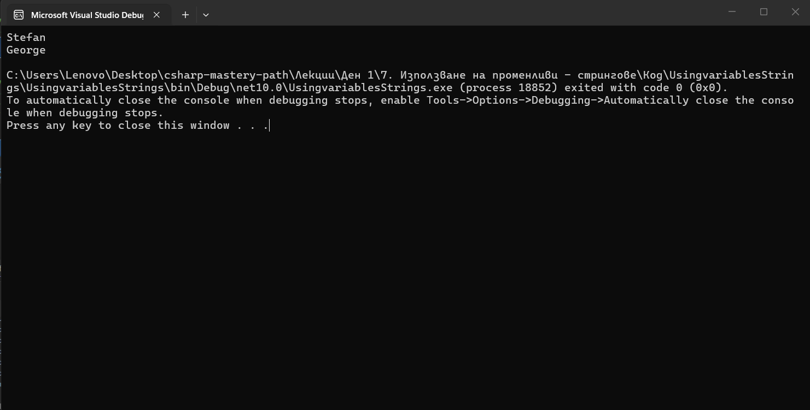

В тази лекция ще видим как можем да декларираме променлива, присвояваме стойност на променлива, променяме променлива и получаваме достъп до нея.
Нека да декларираме една променлива.
Използваме //,  за да създадем коментар.
Нека да създадем променлива, която ще се нарича `myFriendsName`.

> [!code] Деклариране на променлива
> ```csharp
> // declare a variable
string myFriendsName;
>  ```

И по този начин ние я декларираме.
Ние декларирахме променлива, която е от тип `string`, което означава променлива, която може да съдържа данни само от тип `string`.
След това можем да зададем стойност на тази променлива.

> [!code] Присвояване стойност на променлива
> ```csharp
> // assigning a value
myFriendsName = "Stefan";
>  ```


На нов ред ние използвахме името на тази променлива, след което използвахме знака равно и ѝ присвоихме стринг. Как можем да разберем, че това е стринг? Това се дължи на кавичките. Ние винаги започваме стринг с кавички и го завършваме с кавички. Т.е. текста, който ние искаме да съхраним в променлива, трябва да е ограден в кавички. По този начин ние `присвояваме` стойност на променлива.
И всеки път ние завършваме с точка и запетая.
Сега ще използваме променливата и ще го направим вътре в конзолата.

> [!code] Използване на променливата
> ```csharp
> //use the variable
Console.WriteLine(myFriendsName);
>  ```

По този начин ние получаваме `достъп` до променливата.
Това означава, че сега ще представим всичко, което се намира в променливата, което е текст и сега този текст ще се покаже в конзолата.



И виждаме, че наистина се появи `Stefan`.
Как обаче сега можем да заместим това име? Променливите в C# могат да бъдат презаписани, както и променливите по подразбиране, които имаме тук. Така че можем да кажем, че името на нашия приятел сега е:

> [!code] Презаписване на променлива
> ```csharp
> myFriendsName = "George";
Console.WriteLine(myFriendsName);
>  ```

И сега това ще ни даде `George`.



По този начин ние `презаписваме` стойността на променливата.
променливите са наистина важни. Те ни позволяват да съхраняваме данни в паметта и след това да ги използваме повторно.
Ние можем да декларираме и присвоим стойност на променлива и на един ред. Затова не е нужно да правим това на два реда. Можем да го направим и на един ред.

> [!code] Деклариране и присвояване стойност на променлива
> ```csharp
> string myFriendsName2 = "Viktor";
Console.WriteLine(myFriendsName2);
>  ```

Използваме конвенция, където името на променливата е с малка буква, а всяка друга дума започва с главна буква.