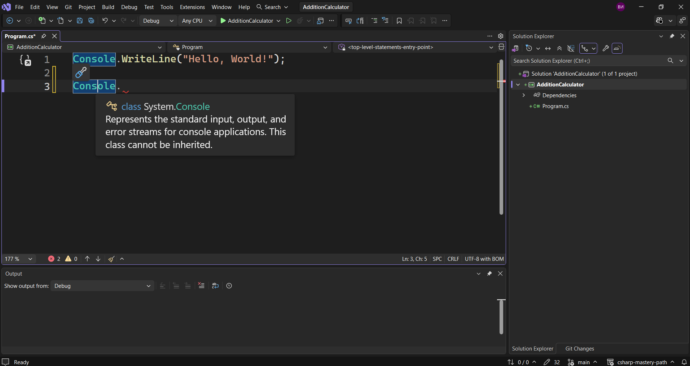
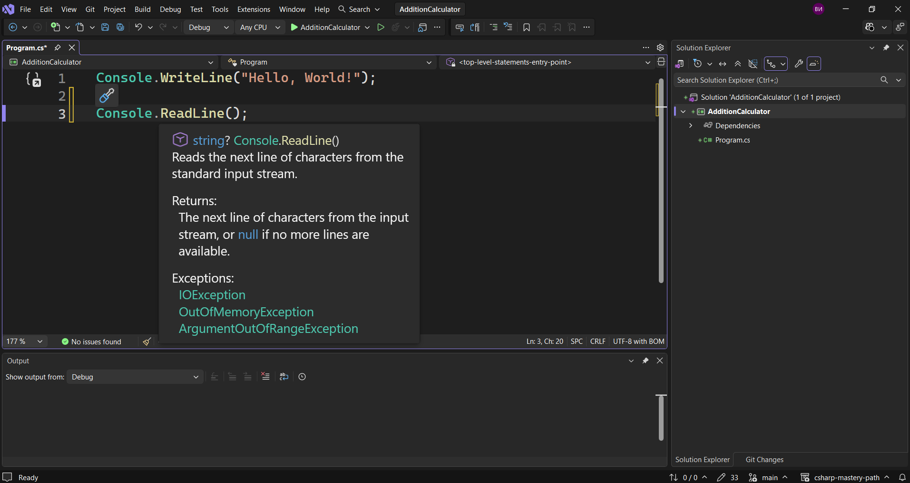
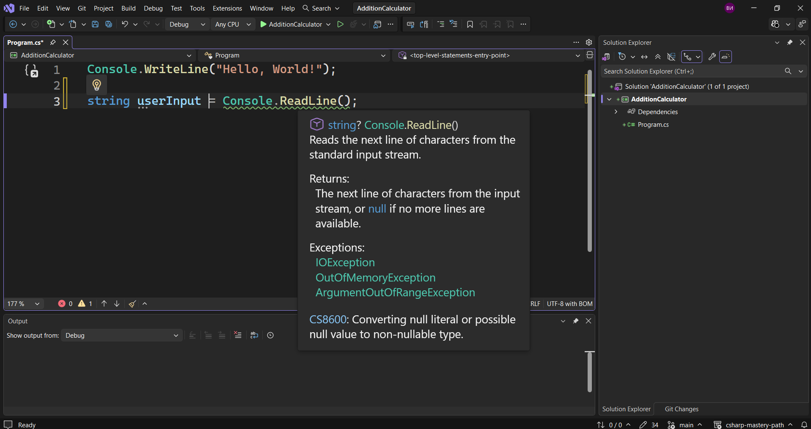
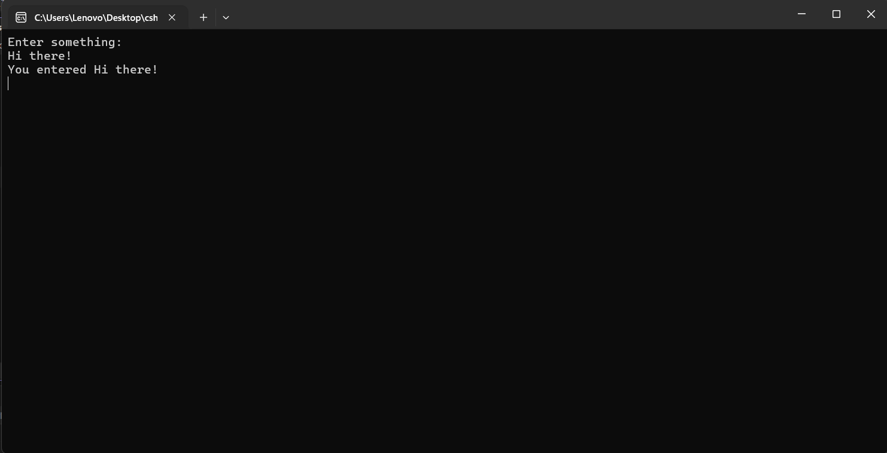

Нека да видим какво ни е необходимо, за да си създадем калкулатор за добавяне.
Първото нещо, което трябва да получим, са входните данни от потребителя. Ние ще разгледаме това в тази лекция.
Второто нещо, което трябва да разберем, е как да съхраняваме данни, как се съхранява стойност.
Третото нещо ще бъдат аритметичните операции, като в този случай това е събиране.
Има и едно допълнително нещо, което трябва да разгледаме и това е как да преобразуваме от един тип данни в друг тип данни. Затова трябва да разберем кои типове данни са подходящи.
Преди да направим каквото и да е, да видим как да получаваме входни данни от потребител.
За целта създаваме нов проект и ще го наречем `AdditionCalculator`.
И така, да видим как да получим данни от потребителя.
За целта ние трябва отново да използваме класа `Console`.



Ако го посочим ще видим, че той представлява стандартните потоци за вход, изход и грешка. Този клас също така не може да се наследява. Доста думи, които не разбираме, но ще разгледаме по-късно.
Важното обаче е, че това ни помага не само за изхода, но и за входа. Това означава, че можем да го използваме, за да получим входни данни от потребител.
За целта освен него, трябва да използваме и метода `ReadLine()`.

 > [!code] Получаване на входни данни от потребител
> ```csharp
> Console.ReadLine();
>  ```

И така, какво представлява този `ReadLine()`?
Както казахме, това е метод. Методът по същество е колекция от код или фрагменти от код, които се изпълняват, когато методът бъде извикан. По-късно ще видим как можем да създаваме собствени методи и да ги извикваме. По този начин ще имаме пълен контрол върху приложенията си.
Засега обаче ще използваме съществуващ метод, който се нарича `ReadLine()`, намиращ се в класа `Console`.
Класовете могат да съдържат множество методи. те могат да съдържат и други неща, но засега ще се концентрираме върху методите.
Как да съхраним въведените от потребителя данни тук? Ще имаме нужда от променливи.



Тук виждаме, че ни се показва, че стрингът връща нещо. Така че този `ReadLine()` след като се изпълни, ще ни върне нещо. Каквото и да въведем, то ще бъде съхранено, както ще направим в този случай с него, или нищо няма да се случи. Затова, за да го съхраним, трябва да използваме променлива.
Ние ще я поставим в началото на този ред.

 > [!code] Съхраняване на входните данни в променлива
> ```csharp
> string userInput = Console.ReadLine();
>  ```

И така, какво се случва тук?
Ние създадохме променливата `userInput`, която е от тип данни `string`. Типът данни `string` е този тип, който служи за текст.
Сега този `ReadLine()` ако го посочим ще видим, че връща стринг.



Каквото и да получим от него, ще се съхрани в променливата `userInput`, която е от тип данни `string`.
Това, което можем да направим сега, е да отпечатаме входните данни, получени от потребителя.

 > [!code] Отпечатване на входните данни в конзолата
> ```csharp
> Console.WriteLine("You entered " + userInput);
>  ```

Тук ние използваме `Console.WriteLine()`, а вътре в скобите казваме `You entered`, последвано от празно място и знака + , който по същество добавя два стринга заедно, т.е. ние създаваме по-голям стринг. И след това показваме въведеното от потребителя.
За да запазим нашата конзола будна и да я затваряме директно след този ред, ще кажем следното.

 > [!code] Предотвратяване на автоматичното затваряне на конзолата
> ```csharp
> Console.ReadKey();
>  ```

Това ще изчака да натиснем произволен клавиш, преди да затвори конзолата.
Вместо да казваме `Hello, World!`, ще го променим на `Enter something:`.
Нека да стартираме това.



Виждаме, че се казва `You entered Hi there!`.
Нека да видим какво се случи тук.
Принципно след като въведохме това, което системата ни помили да въведем тук, и след това имаме този `ReadLine()` метод, който очаква въвеждането на входни данни от потребителя, без значение какво ще бъде въведено и ще се съхрани в променливата `userInput` от тип `string`, който е типът данни, използван за текст. И накрая го отпечатваме с помощта на нещо, наречено `конкатенация`.
Сега вече знаем как да използваме потребителския вход.
Научихме и за един тип данни, наречен стринг.


