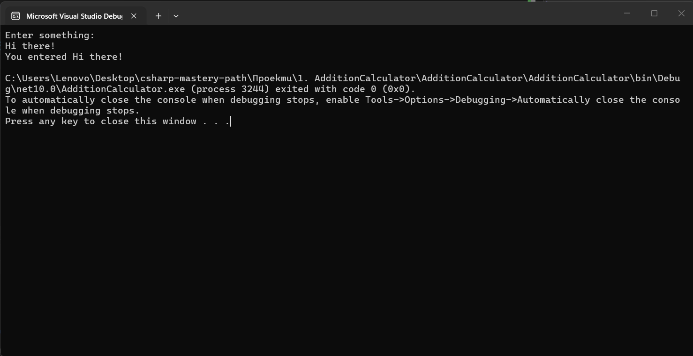
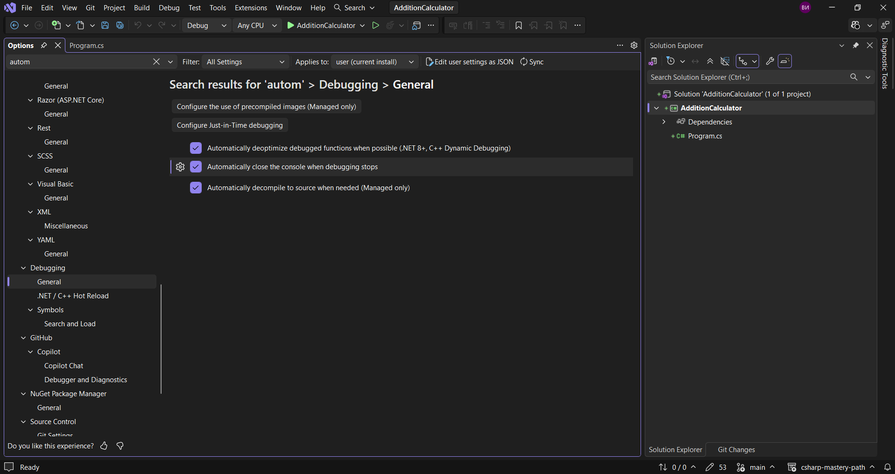

В тази лекция нека да видим как можем да се отървем от този текст в конзолата.



По този начин ще имаме пълен контрол върху нашата конзола.
Това се генерира за нас, но ние не искаме да го виждаме. Виждаме обаче и откъде можем да го деактивираме, затова нека да отидем там.



Тук трябва да маркираме средното квадратче.
Ако сега пуснем конзолата ще видим, че тя се затваря веднага.
За да сме сигурни, че това няма да се случи, накрая добавяме следното.

 > [!code] Предотвратяване на автоматичното затваряне на конзолата
> ```csharp
> Console.ReadKey();
>  ```

Това ще изчака потребителя да натисне клавиш и след това ще се затвори.
