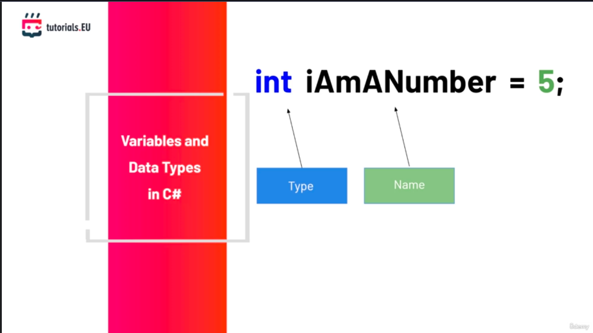

В тази лекция ще поговорим за променливите, понеже те са много важен аспект  във всеки език за програмиране.
Променливата е контейнер, който може да побере стойност и може би след известно време ще решим да съхраним друга стойност в същата променлива или в същия контейнер.
Нека разгледаме този тривиален пример.
Да си представим, че сме на открит бюфет и искаме да се наследим на чаша кафе, заедно с невероятен сладкиш.
Ще ни трябва чаша за кафето и чиния за сладкиша, защото чашата за кафе е предназначена за течности, а не за сладкиши.
Слагането на сладкиш в чашата за кафе няма да работи, защото няма да се побере и защото хората вероятно ще ни гледат странно.
Точно така функционират променливите.
Ако сравним променливите с нашия пример с кафето и сладкиша, една променлива трябва да има `тип`, например типа на чинията или чашата.
Типът на променливата ни казва какъв вид може да съхранява тя, къде се намират данните - нашата храна или напитка.
Тъй като в нашите програми работим с множество променливи, трябва да правил разлика между тях, като даваме `име` на всяка променлива.
Това означава, че имаме `тип`, `име` и `данни`, които една променлива съдържа.
В C# една променлива се дефинира по следния начин. Да кажем, че искаме да съхраним цяло число, като целите числа са числа като 1, 2 и т.н. Тогава типът на променливата ще бъде `int`.

> [!code] Деклариране на променлива от тип int
> ```csharp
> int iAmANumber = 5;
>  ```

`iAmANUumber` е името на променливата, а 5 е стойността на променливата.



По този начин създаваме променлива от тип `int` и в нея съхраняваме числото 5.
Има и други типове данни в C# освен `int`. Тези, за които трябва да знаем поне засега, са `float` за съхранение на числа с плаваща запетая. Можем да ги използваме за съхранение на стойности като скорост например.
След това имаме `bool`, който можем да използваме за съхранение на булеви стойн
