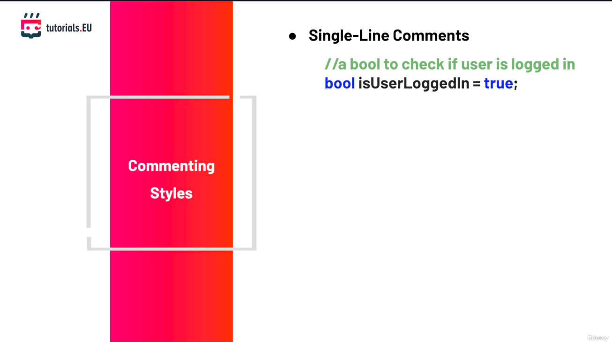

В тази лекция ще покрием стандартите за кодиране.
В основата си стандартите за кодиране представляват набор от насоки, добри практики и стилове, които програмистите следват, когато пишат софтуер за даден проект. Така че всички големи софтуерни компании се придържат към тези стандарти, а самите компании също имат свои собствени стандарти.
Това са само няколко примера за стандарти за кодиране.
Когато работим в дадена компания, естествено ще ни кажат да пишем кода си по определен начин, защото те така го правят.
Нека разгледаме частите на стандартите за кодиране.

#### Трябва винаги да даваме смислени имена на променливите си

При декларирането на една променлива, програмистът трябва да ѝ даде подходящо име. Името на променливата трябва да се определи от нейното предназначение.
Трябва да помислим за какво ще използваме тази променлива и след това да ѝ дадем име, което да описва за какво всъщност се използва тя.
Ако например искаме да съхраним възраст на потребител, добро име за тази променлива би било `age` или `userAge`.

#### Трябва също така да даваме точни имена и за нашите функции

Една функция трябва да получи име, която се основата на функцията (действието), което тя изпълнява в кода или програмата.
Принципно функциите извършват действията правилно. Ако например искаме да създадем функция, която проверява интернет връзката, можем да я кръстим `CheckInternetConnection()`.

#### Коментари

Добра практика е винаги да оставяме коментари в кода си, а в големите компании това е задължително.
Функциите трябва да бъдат придружени с коментари, които обясняват тяхното предназначение и функционалност. Това помага на други програмисти, работещи по същия проект, да разберат за какво се използва тази функция. Това не важи само за другите програмисти, а и за нас.
Ако се върнем към кода си след няколко години или няколко месеца, ще установим, че е много трудно да разберем собствения си код, ако нямаме подходящи коментари и ще трябва да започнем отначало.
Сега да разгледаме различните видове коментари, които можем да използваме в проектите ни.

##### Едноредови коментари

Съществуват едноредови коментари, и това е едноредов коментар, който можем да видим тук.

Полезно е да се описва например какво представляват променливи или за какво служи една if-конструкция.

##### Многоредови коментари

Освен това съществуват многоредови коментари, които служат за коментиране на повече от един ред.
те започват така /* и приключват така * /.
Те могат да обхващат няколко реда.
Можем да поставим много коментари там и всичко това няма да бъде имплементирано от компилатора.
Това означава, че те са предназначени единствено за четене от програмиста.

##### XML документация

Можем да използваме XML документацията - коментари, които се използват за генериране на документация за функции или класове.

