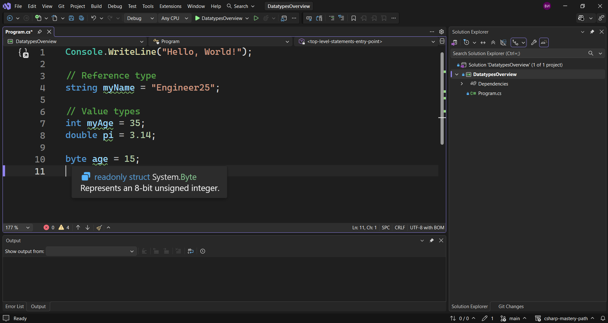
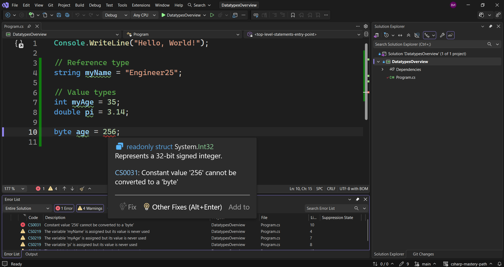
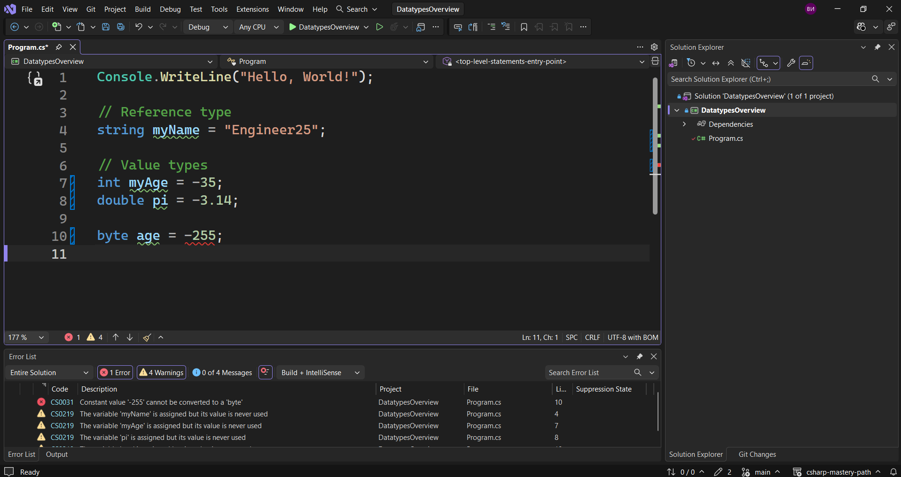

В тази лекция ще разгледаме типовете данни.
Има различни типове данни. Ние досега сме използвали само два типа данни - `референтни типове`, като стринг.

> [!code] Референтен тип стринг
> ```csharp
> string myName = "Engineer25";
>  ```

Също така използвахме и `стойностния тип` int.

> [!code] Стойностен тип int
> ```csharp
> int myAge = 35;
>  ```

или 

> [!code] Стойностен тип double
> ```csharp
> double pi = 3.14;
>  ```

Това са типовете, които използвахме, като 

> [!code] Стойностни типове
> ```csharp
> double pi = 3.14;
> int myAge = 35;
>  ```

са стойностни типове, а 

> [!code] Референтен тип стринг
> ```csharp
> string myName = "Engineer25";
>  ```

е референтен тип.
Имаме и други типове данни, като например потребителски типове данни, които ние ще създадем по-късно, `pointers`, `struct`, в които ние ще задълбаем по-късно, понеже те имат наистина яки ключови думи и ще ги покрием по-късно.
След това имаме `nullable` типове, което означава, че стойността им може да бъде `null` или не. Т.е. те може да имат стойност, или да бъдат празни (null).
`Nullable` типовете са доста важни, особено ако ние сваляме някакви данни и искаме да ги съхраняваме и нека да кажем ,че данните могат да бъдат нещо или да не бъдат нищо и ние не искаме нашата програма да се срине, просто защото данните идват под формата на нищо и затова трябва да се справим с този проблем. Точно затова `nullable` типовете са толкова полезни.
Те се появиха в C# след няколко години, след като те вече бяха в други програмни езици, но тук бяха добавени малко по-късно.
нека се върнем към стойностните типове. Те са доста и някои от тях дори имат сходни имена, като например `byte`, `signed byte`, `unsigned byte`.
Каква обаче е разликата тук?
Нека да направим няколко примера.
Нека да кажем 

> [!code] Деклариране на байт
> ```csharp
> byte age = 15;
>  ```

Той представлява 8-битово цяло число без знак.



Неговата стойност може да варира между 0 и 255, което е този байт без знак (unsigned byte). Това означава, че ако сменим стойността

> [!code] Деклариране на байт
> ```csharp
> byte age = 255;
>  ```

това все още ще работи, но ако сменим на 256, ще видим, че компилаторът ни казва, че 256 е прекалено голямо число за този тип данни.



Тук дори ни се казва, че трябва да използваме `int`, тъй като той е 32-битово цяло число със знак.
2 на 8-ма, което е стойността, която един байт може да съдържа, което е 256, което е и причината байт да може да съдържа 256 числа. `int` обаче е 2 на 32-ра, което е значително по-голямо число, приблизително 4.3 милиарда. Това е колко точно един `insigned int` може да побере.
Ако използваме `int`, можем да видим, че можем да имаме и отрицателни числа, както и при `double`, но ако опитаме да имаме отрицателно число при `byte`, ще имаме грешка.



Затова вместо `byte` трябва да използваме `sbyte`. Това ни позволява да използваме отрицателни числа.
Ако искаме да използваме цяло число без знак, тогава можем да използваме `uint`, но тогава няма да можем да използваме отрицателни числа. 
Разликата между `signed` и `unsigned int` е че:
- **Със знак (Signed):** Може да съхранява както **положителни**, така и **отрицателни** числа, както и нула.
    
- **Без знак (Unsigned):** Може да съхранява **само положителни** числа (и нула), но за сметка на това достига два пъти по-голяма максимална положителна стойност при същия размер в паметта.

Сега нека да разгледаме `short`.
Един `short` може да съдържа стойности от - 32 768 до  32 767. Това може да бъде например тип данни, използван за съхраняване броя на връзките, които можем да имаме в LinkedIn. Броят на приятелите, така да се каже, които можем да имаме в LinkedIn, e 30 000.
Следователно може да се каже, че става на въпрос за свързани връзки. Това е нещо, което можем да съхраним в един `short`.

> [!code] Деклариране на short
> ```csharp
> short linkedinConnections = 32500;
>  ```

Така един байт съдържа 8 бита стойност, а един `short` - 16.
В двойчната система, едно 8-битово число има единици и нули на осем позиции, 16-битовото число има 16 позиции, а цялото число (int) - 32 позиции.
Имаме и `double`, който заема 64 позиции.
След това имаме `long`, който също се използва за числа. Можем да го използваме за съхранение на телефонни номера например. Бихме могли да имаме много дълъг телефонен номер като този например

> [!code] Деклариране на long
> ```csharp
> long phoneNumber = 01234567890;
>  ```

Това може да се сметне за телефонен номер.
Можем да записваме подобни числа и като стрингове. Ако обаче желаем да използваме `long`, можем да го направим.
Също така съ